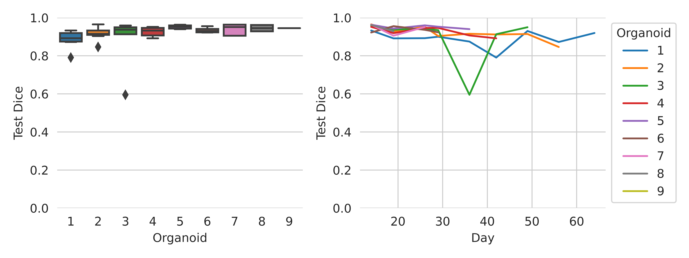
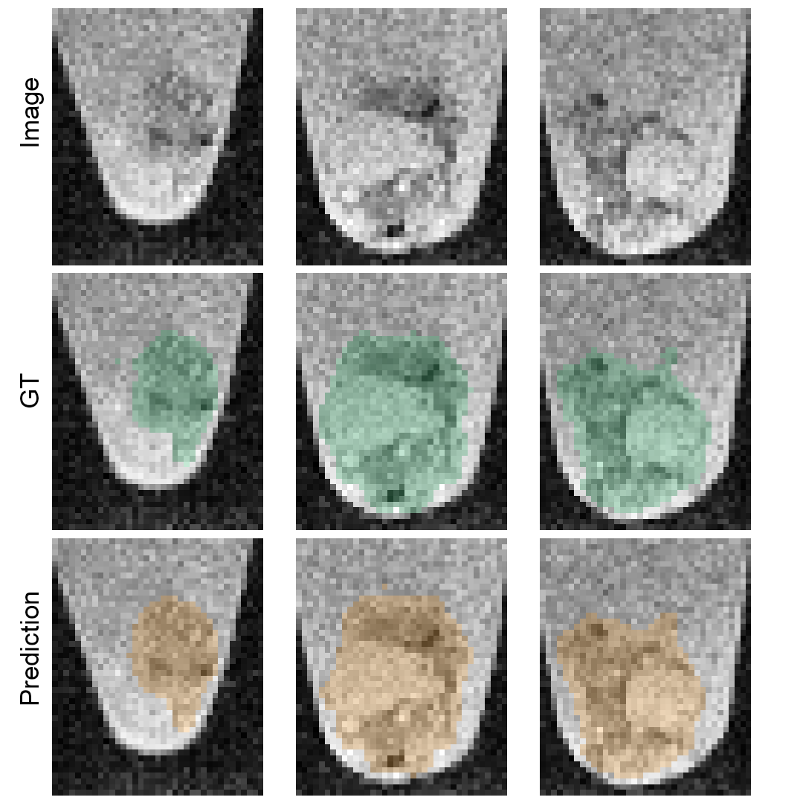
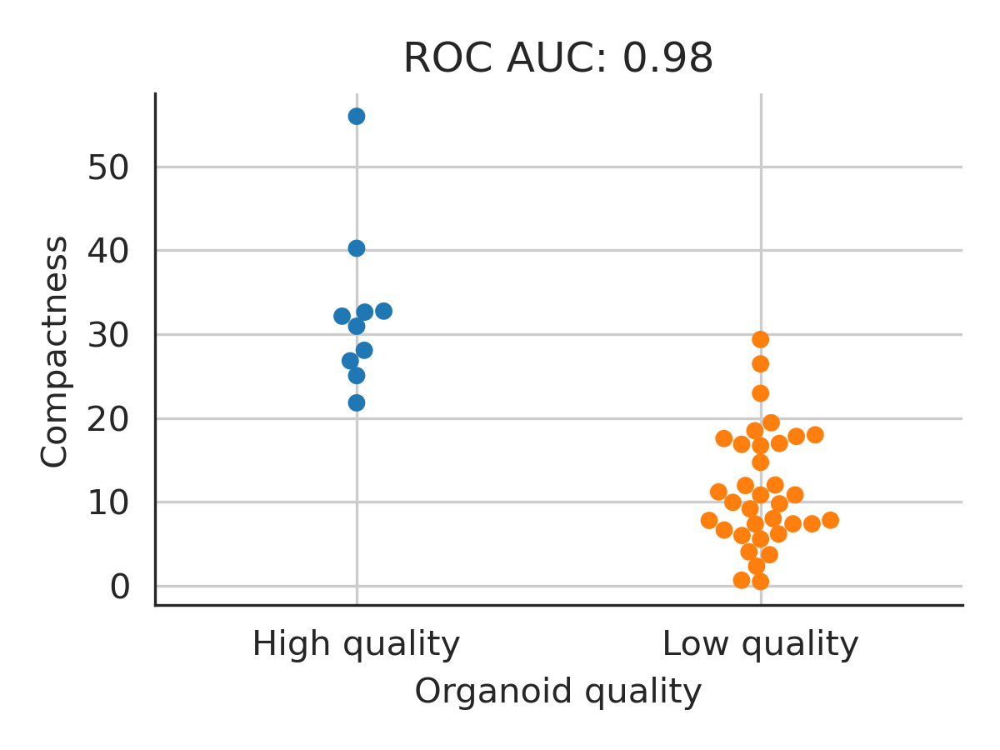
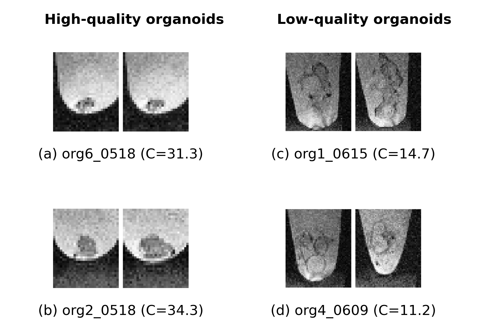
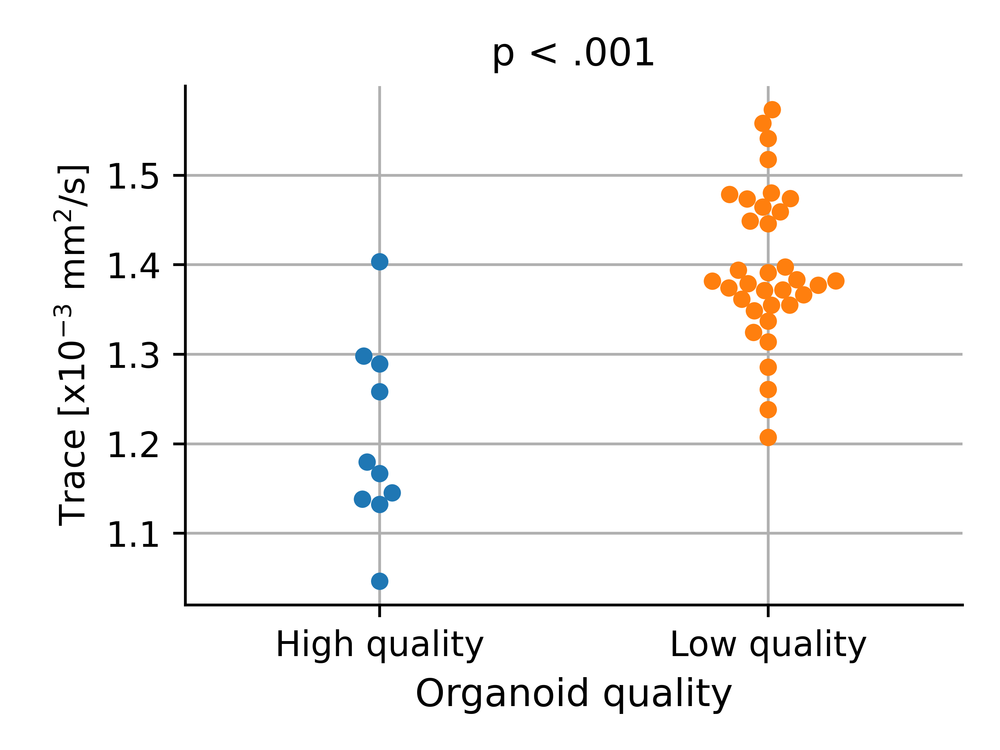
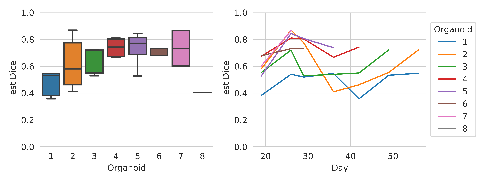
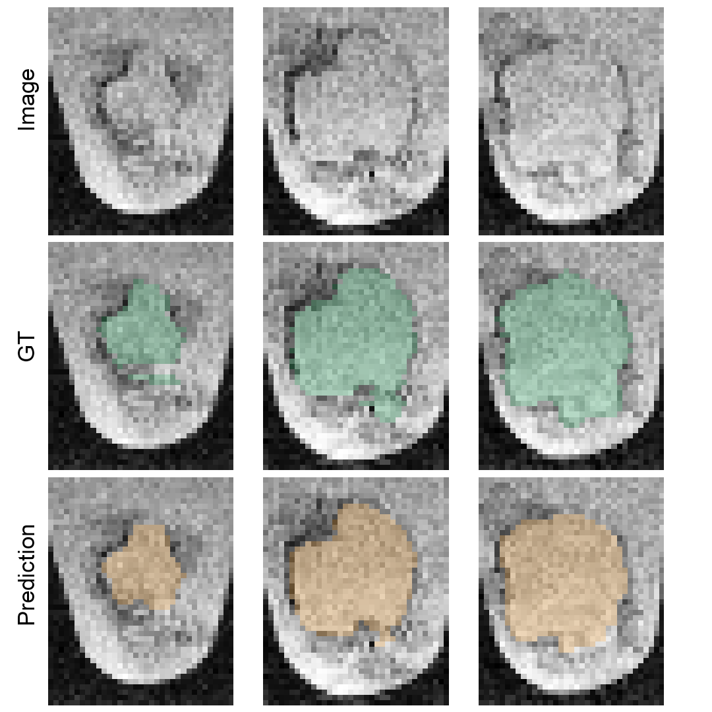
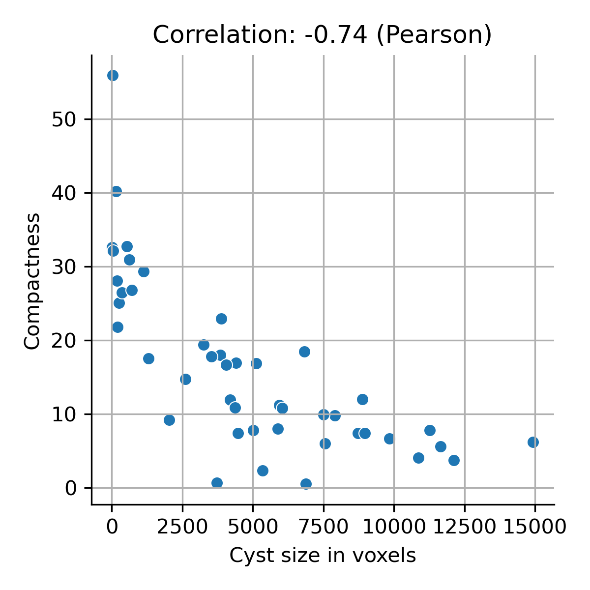

# Cerebral organoid quantification in MRI

This repository quantifies cerebral organoids in MRI. It especially implements three tasks:
- Organoid segmentation
- Global cysticity classification
- Local cyst segmentation

These tasks are presented in the paper Cerebral organoid quantification in MRI.

For the implementation of the 3D U-Net, the full credit goes to Adrian Wolny (https://github.com/wolny/pytorch-3dunet).

## Prerequisites

* Operating system: Windows or Linux (tested on Ubuntu 18.04) **Adapt**
* [Anaconda Distribution](https://www.anaconda.com/distribution/#download-section) **Adapt**

## Installation
```
git clone https://github.com/deiluca/cerebral_organoid_quant_mri
```
Install requirements
```
cd path/to/cerebral_organoid_quant_mri
conda env create -f requirements.yml
```

Activate the conda environment:

```
conda activate co_quant_mri
```


## Data preparation

1. Download the data from x: Describe how to unpack exactly and where

2. Image extraction and data preparation
    ```
    python scripts/extract_and_prepare_images.py
    ```

## Organoid segmentation

1. Train and test 3D U-Net. [can be skipped: results from previous run are located in results/organoid_segmentation]
     ```
     python scripts/train_organoid_seg.py
     python scripts/test_organoid_seg.py
     ```
2. Extract and inspect results using [scripts/data_analysis.ipynb](scripts/data_analysis.ipynb)

**Model performance** (Test Dice 0.92&#177;0.06 [mean&#177;SD])



**Example of segmentation performance (org7_0530)**



## Global cysticity classification
See [scripts/data_analysis.ipynb](scripts/data_analysis.ipynb)


**Performance of *Compactness* and examples of low- and high-quality organoids**




**DW-MRI: Higher diffusion of low-quality organoids**



## Local cyst segmentation
1. Train and test 3D U-Net. [can be skipped: results from previous run are located in results/local_cyst_segmentation]
     ```
     python scripts/train_local_cyst_seg.py
     python scripts/test_local_cyst_seg.py
     ```
2. Extract and inspect results using [scripts/data_analysis.ipynb](scripts/data_analysis.ipynb)

**Model performance** (Test Dice 0.63&#177;0.15 [mean&#177;SD])



**Example of segmentation performance (org7_0530)**



**Can compacntess predict cysticity?**

Yes, high correlation. Extract and inspect results using [scripts/data_analysis.ipynb](scripts/data_analysis.ipynb)



Please note that repeated 3D U-Net training runs might lead to slightly different results. This is caused by random initialization of 3D U-Net weights.

If you find this useful, please consider citing our work: