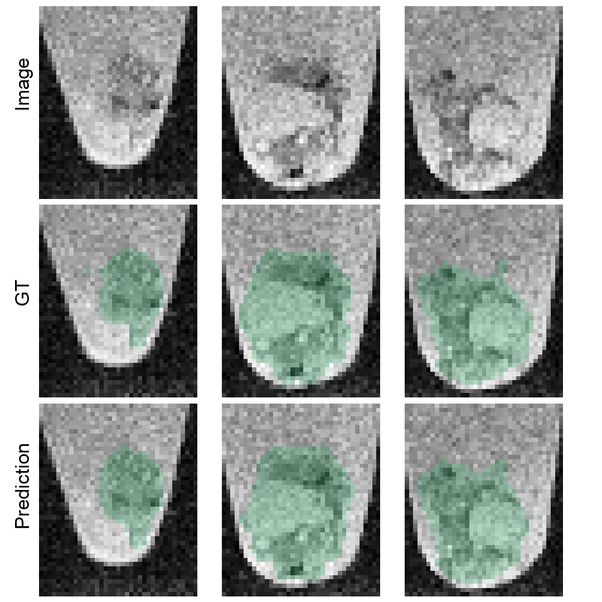
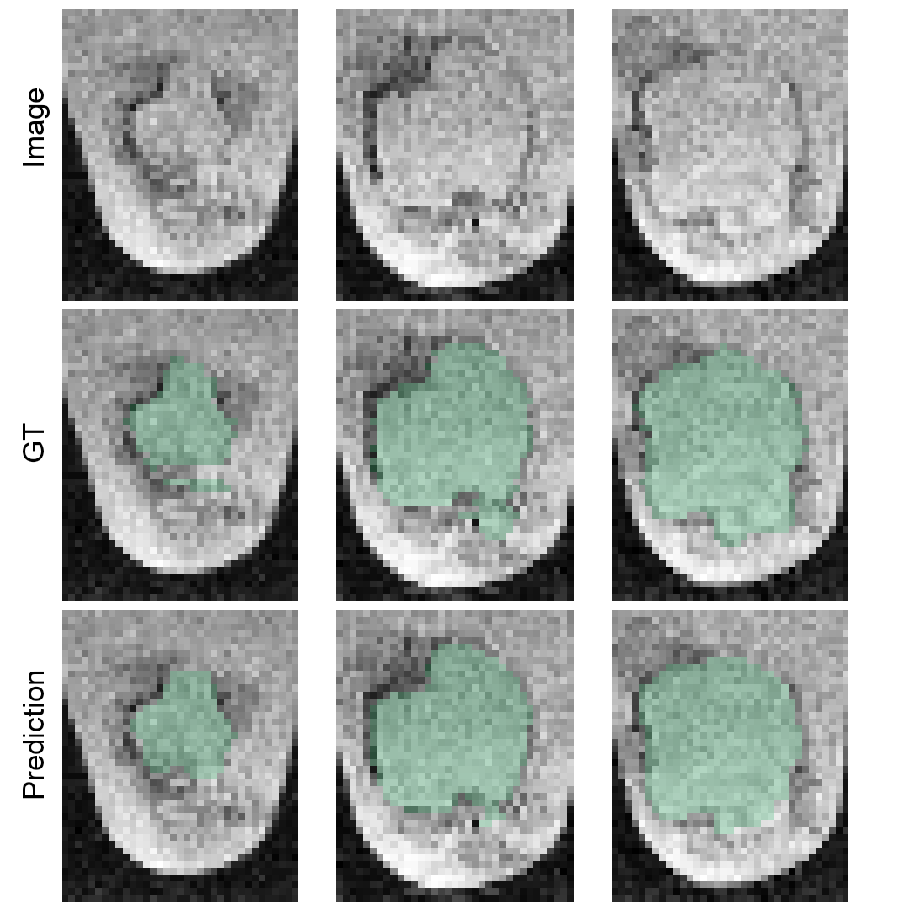

# Cerebral organoid quantification in MRI

This repository reproduces the results from the paper MRI

This repository quantifies cerebral organoids in MRI. It especially implements three tasks:
- organoid segmentation
- global cyst classification
- local cyst segmentation

## Prerequisites

* Operating system: Windows (tested on Windows 10) or Linux (tested on Ubuntu 18.04) **Adapt**
* [Anaconda Distribution](https://www.anaconda.com/distribution/#download-section) **Adapt**
* For GPU use: a CUDA capable GPU **Adapt**
* Minimum / recommended RAM/VRAM: 8 GiB / 16 GiB **Adapt**

## Installation
```
git clone https://github.com/deiluca/cerebral_organoid_quant_mri
```

```
cd path_to_your_cloned_repository
conda env create -f requirements.yml
```

Activate the co_quant_mri_ve:

```
conda activate co_quant_mri_ve
```

## Data preparation

1. Download the data from x: Describe how to unpack exactly and where

2. Image extraction and data preparation
    ```
    python scripts/extract_and_prepare_images.py
    ```

## Organoid segmentation

1. train and test 3D U-Net. [can be skipped: results from previous run are located in results/organoid_segmentation)]
2. inspect results using scripts/data_analysis.ipynb

**Model performance**


**Example of segmentation performance (org7_0530)**



## Global cyst classification
See scripts/data_analysis.ipynb

**Performance of *Compactness* and examples of low- and high-quality organoids**


## Local cyst segmentation
1. train and test 3D U-Net. [can be skipped: results from previous run are located in results/local_cyst_segmentation]
2. generate and inspect results using scripts/data_analysis.ipynb

**Model performance**


**Example of segmentation performance (org7_0530)**


     