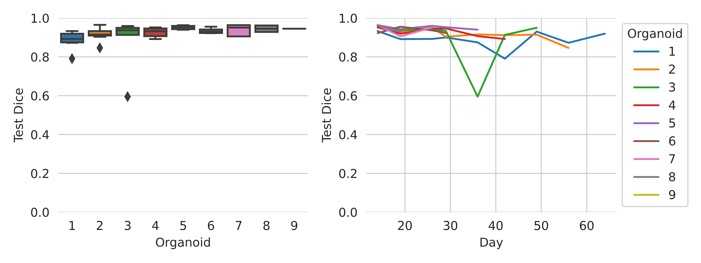

# Cerebral organoid quantification in MRI
[](https://github.com/deiluca/cerebral_organoid_quant_mri/actions/workflows/pylint.yml)

This repository reproduces the results published in the paper "Cerebral organoid quantification in MRI"

Specifically, it especially implements three tasks:
- Organoid segmentation
- Global cysticity classification
- Local cyst segmentation

For the implementation of the 3D U-Net, the full credit goes to Adrian Wolny (https://github.com/wolny/pytorch-3dunet).

## Prerequisites

* Operating system: Windows or Linux (tested on Ubuntu 20.04)
* [Install Anaconda](https://docs.conda.io/projects/conda/en/latest/user-guide/install/index.html#installing-conda-on-a-system-that-has-other-python-installations-or-packages)

## Installation
```
git clone https://github.com/deiluca/cerebral_organoid_quant_mri
```
Install conda environment
```
cd path/to/cerebral_organoid_quant_mri
conda env create -f environment.yml
```

Activate the conda environment:

```
conda activate co_quant_mri
```

Add this line to ~/.bashrc to permanently add the repository to PYTHONPATH
```
export PYTHONPATH="${PYTHONPATH}:path/to/cerebral_organoid_quant_mri"
```


## Data preparation

1. Download the data from Zenodo and unpack it in data/data_zenodo

2. Image extraction and data preparation
    ```
    python scripts/extract_and_prepare_images.py
    ```

## Organoid segmentation

1. Train and test 3D U-Net. (can be skipped: checkpoints from previous run are located [here](results/organoid_segmentation/checkpoint_dirs_trained_previously))
     ```
     python scripts/train_segmentation.py org_seg
     python scripts/test_segmentation.py org_seg
     ```
2. Extract and inspect results using [scripts/data_analysis.ipynb](scripts/data_analysis.ipynb)

**Model performance** (Test Dice 0.92&#177;0.06 [mean&#177;SD])



**Example of segmentation performance (org7_0530)**


## Global cysticity classification
See [scripts/data_analysis.ipynb](scripts/data_analysis.ipynb)


**Performance of *Compactness* and examples of low- and high-quality organoids**


**DW-MRI: Higher diffusion of low-quality organoids**


## Local cyst segmentation
1. Train and test 3D U-Net. (can be skipped: checkpoints from previous run are located [here](results/local_cyst_segmentation/checkpoint_dirs_trained_previously))
     ```
     python scripts/train_segmentation.py local_cyst_seg
     python scripts/test_segmentation.py local_cyst_seg
     ```
2. Extract and inspect results using [scripts/data_analysis.ipynb](scripts/data_analysis.ipynb)

**Model performance** (Test Dice 0.63&#177;0.15 [mean&#177;SD])


**Example of segmentation performance (org7_0530)**


**Is compactness a predictor of organoid cysticity?**

Yes, high correlation. Extract and inspect results using [scripts/data_analysis.ipynb](scripts/data_analysis.ipynb)


Please note that repeated 3D U-Net training runs might lead to slightly different results. This is caused by random initialization of 3D U-Net weights.

If you find this useful, please consider citing our work: